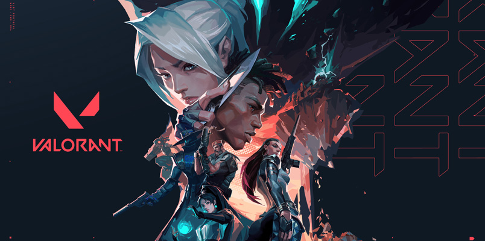
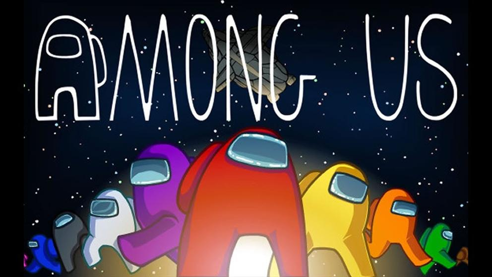

# Pablo Zúñiga  

Algo de infromación sobre mí realizado desde **GitHub**.  

## Sobre mí

Soy un joven, natural de Pamplona y me gusta la **informática**. Desde pequeño me ha interesado mucho el mundo de la informática y las tecnologías. Tambien tengo alguno hobby como la **fotografía**. Hace unos 2 años me compré mi primera cámara réflex. Suelo compartir mis fotografias en mi perfíl de Instagram - [_@zyko_ph_](https://www.instagram.com/zyko_ph/).

Escucho todo tipo de **música**, esto es algo que tambien me gusta. Escucho música para todo, me ayuda mucho a concentrarme y a su vez a desconectar.

### Mis habilidades con algunos programas y lenguajes de programación

|Programas|Nivel|
|--|--|
|Photoshop      |Nivel Avanzado
|HTML           | Nivel Avanzado
|VisualBasic    | Nivel Bajo
|Java           | Nivel Medio
|Excel - Access | Nivel Medio

### También juego a videojuegos, como:
- COD Warzone
- Valorant
- CS:GO
- GTA V
-Among Us

>**Valorant**

>**Among Us**

